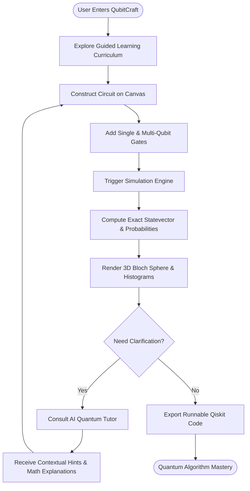
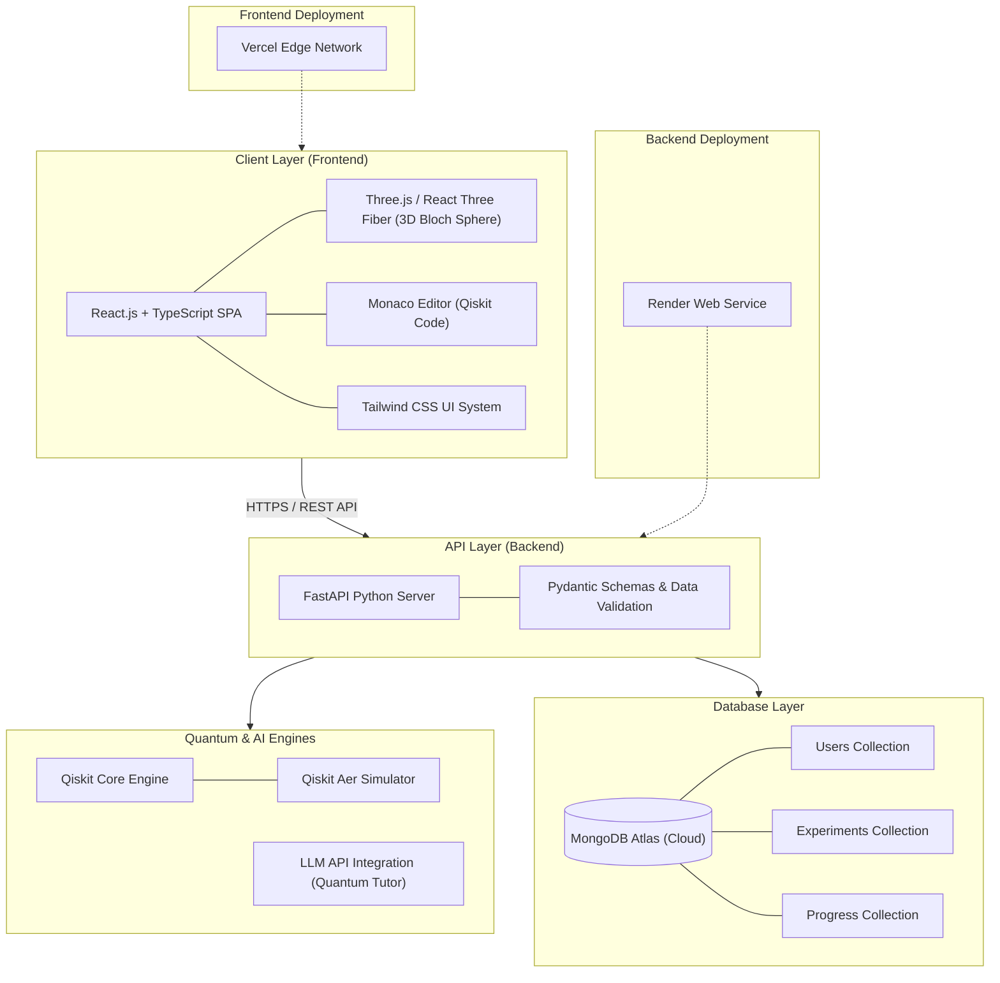
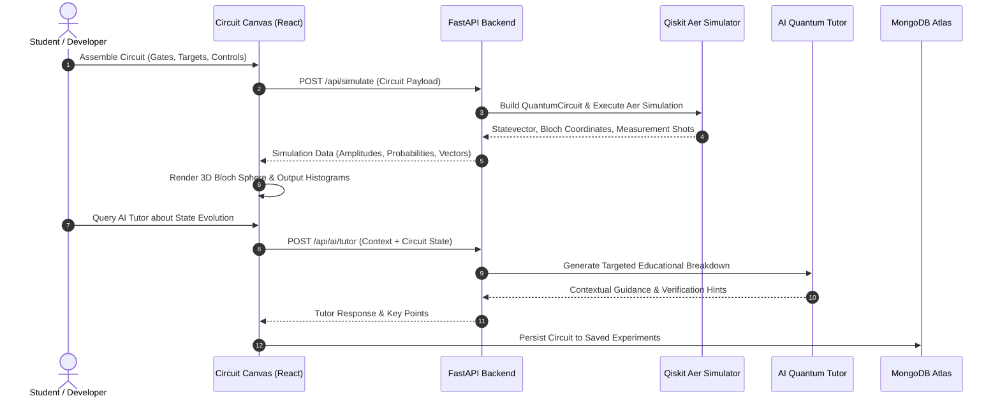

<div align="center">

# QubitCraft

### *"See Quantum. Build Quantum. Understand Quantum."*

**AI-Powered Interactive Quantum Computing Learning Platform**

---

[](https://sih.gov.in/)
[](https://sih.gov.in/)
[]()
[]()
[]()
[]()

<br />

[Live Demo](https://qubitcraft.vercel.app) • [GitHub Repository](https://github.com/girishivansh/QubitCraft) • [Demo Video]([ADD DEMO VIDEO URL])

<br />

```
========================================================================================
   |0⟩ ───[ H ]───●───[ Measure ] ───▶ |Ψ⟩ = (|00⟩ + |11⟩) / √2 ───▶ 3D Bloch Sphere
                  │
   |0⟩ ───────────X───[ Measure ] ───▶ Interactive Simulation ───▶ AI Quantum Tutor
========================================================================================
```

<br />

<p align="center">
  
</p>

</div>

---

## 🏛️ Smart India Hackathon 2026 Overview

<table>
  <tr>
    <td width="30%"><strong>Event</strong></td>
    <td><strong>Smart India Hackathon 2026</strong></td>
  </tr>
  <tr>
    <td><strong>Problem Statement ID</strong></td>
    <td><code>SIH26140</code></td>
  </tr>
  <tr>
    <td><strong>Theme</strong></td>
    <td>Smart Education</td>
  </tr>
  <tr>
    <td><strong>Category</strong></td>
    <td>Software</td>
  </tr>
  <tr>
    <td><strong>Team ID</strong></td>
    <td><code>171105</code></td>
  </tr>
  <tr>
    <td><strong>Team Name</strong></td>
    <td><strong>SRIJAN</strong></td>
  </tr>
  <tr>
    <td><strong>Project Title</strong></td>
    <td><strong>QubitCraft</strong></td>
  </tr>
</table>

---

## ⚠️ The Quantum Education Problem

Quantum computing represents the frontier of modern computational power, but foundational education in the field faces severe systemic bottlenecks:

- **Abstract Mathematical Hurdles**: Beginners encounter complex linear algebra, Hilbert spaces, and Dirac notation before understanding physical intuition.
- **Invisible Phenomena**: Key principles such as superposition, entanglement, phase shift, and interference happen in multi-dimensional state spaces that cannot be observed directly without visualization.
- **Fragmented Tooling**: Students must constantly switch between static textbook theory, isolated circuit simulators, external AI chatbots, and distinct code runtimes.
- **Black-Box Circuit Construction**: Novices drag gates onto quantum registers without immediate visual feedback on what is happening to the statevector.
- **High Barrier to Practical Coding**: Bridging the gap between conceptual circuit diagrams and production frameworks like Qiskit creates cognitive friction for self-directed learners.

---

## 💡 The Solution: QubitCraft

**QubitCraft** dismantles these barriers by unifying interactive curriculum, drag-and-drop circuit design, real-time quantum simulation, 3D state visualization, and contextual AI tutoring into a single integrated workspace.

### The Core Learning Journey

```
┌────────────────┐
│     LEARN      │ ── Structured conceptual lessons & interactive theory
└───────┬────────┘
        ▼
┌────────────────┐
│   UNDERSTAND   │ ── Intuitive principles explained step-by-step
└───────┬────────┘
        ▼
┌────────────────┐
│     BUILD      │ ── Interactive drag-and-drop quantum circuit builder
└───────┬────────┘
        ▼
┌────────────────┐
│    SIMULATE    │ ── Statevector and shot-based simulation via Qiskit
└───────┬────────┘
        ▼
┌────────────────┐
│   VISUALIZE    │ ── Real-time 3D Bloch spheres & probability distributions
└───────┬────────┘
        ▼
┌────────────────┐
│  GET INSIGHTS  │ ── AI Quantum Tutor contextual feedback & guidance
└───────┬────────┘
        ▼
┌────────────────┐
│  LEARN BETTER  │ ── Mastery through continuous visual experimentation
└────────────────┘
```

---

## ✨ Key Features

<table>
  <tr>
    <td width="50%" valign="top">
      <h3>📚 Interactive Quantum Learning</h3>
      <p>Progressive, structured curriculum designed to build foundational understanding from single-qubit mechanics to multi-qubit entanglement and quantum algorithms.</p>
      <p align="center"><em>[ADD LEARNING SCREENSHOT]</em></p>
    </td>
    <td width="50%" valign="top">
      <h3>🎛️ Quantum Circuit Builder</h3>
      <p>Intuitive grid interface to construct circuits with standard quantum gates (H, X, Y, Z, Phase, CNOT, SWAP, Measurement) with parameter configurations.</p>
      <p align="center"><em>[ADD CIRCUIT BUILDER GIF]</em></p>
    </td>
  </tr>
  <tr>
    <td width="50%" valign="top">
      <h3>⚙️ Real-Time Quantum Simulation</h3>
      <p>Execute quantum circuits and analyze exact amplitudes, phase angles, statevectors, and statistical measurement shot distributions powered by Qiskit Aer.</p>
      <p align="center"><em>[ADD SIMULATION SCREENSHOT]</em></p>
    </td>
    <td width="50%" valign="top">
      <h3>🌐 3D Quantum State Visualization</h3>
      <p>Interactive 3D Bloch sphere representation rendering single-qubit state evolutions, polar/azimuthal angles, and relative phases powered by Three.js.</p>
      <p align="center"><em>[ADD BLOCH SPHERE GIF]</em></p>
    </td>
  </tr>
  <tr>
    <td width="50%" valign="top">
      <h3>🤖 AI-Powered Quantum Tutor</h3>
      <p>Context-aware educational assistant providing targeted hints, mathematical breakdowns, gate behavior explanations, and circuit debugging assistance.</p>
      <p align="center"><em>[ADD AI TUTOR GIF]</em></p>
    </td>
    <td width="50%" valign="top">
      <h3>🔍 Quantum Algorithm Explorer</h3>
      <p>Step-by-step walkthroughs of cornerstone quantum algorithms including Deutsch-Jozsa, Bernstein-Vazirani, Grover's Search, and Quantum Fourier Transform.</p>
      <p align="center"><em>[ADD ALGORITHM EXPLORER GIF]</em></p>
    </td>
  </tr>
  <tr>
    <td colspan="2" valign="top">
      <h3>💻 Runnable Qiskit Code Generator</h3>
      <p>Seamlessly transitions visual learners into code-level developers by auto-generating production-ready Python Qiskit code from constructed visual circuits.</p>
    </td>
  </tr>
</table>

---

## 🔄 Product Experience Workflow



---

## 🏛️ System Architecture

QubitCraft uses a decoupled full-stack architecture designed for performance, modularity, and rapid mathematical computation.



---

## ⚛️ Quantum Simulation Pipeline



---

## 🤖 AI Quantum Tutor

The integrated **AI Quantum Tutor** acts as a personalized pedagogical companion throughout the quantum workspace:

- **Context-Aware Insights**: Inspects the active circuit, selected gate, learner level, and simulation results to provide relevant explanations rather than generic theory.
- **De-mystifying Quantum Math**: Translates matrix multiplications, statevector notation, and complex amplitudes into clear, visual intuition.
- **Circuit Debugging**: Highlights unintentional phase cancellations, unintended decoherence, or redundant gate operations in user designs.
- **Guided Inquiry**: Provides scaffolded hints for curriculum challenges rather than immediately giving away solutions.
- **Algorithm Exploration**: Breaks down multi-step quantum algorithms (such as oracle construction in Grover's Search) into digestible checkpoints.

<p align="center">
  
</p>

---

## 🌐 3D Quantum Visualization

The visual engine provides real-time geometric and mathematical representations of quantum systems:

- **Interactive 3D Bloch Sphere**: Inspect pure state trajectories on the unit sphere $|\psi\rangle = \cos(\theta/2)|0\rangle + e^{i\phi}\sin(\theta/2)|1\rangle$ with customizable rotation angles.
- **Statevector Inspector**: Full breakdown of basis states ($|00\dots0\rangle$ to $|11\dots1\rangle$) including real and imaginary components, phase angles, and magnitudes.
- **Probability Histograms**: Shot-based statistical distributions contrasting theoretical state probabilities with measurement sampling outcomes.

<p align="center">
  
</p>

---

## 🔬 Quantum Algorithm Explorer

Learners explore milestone quantum computing algorithms through structured, interactive stages:

```
┌──────────────┐     ┌──────────────┐     ┌──────────────┐     ┌──────────────┐
│  Algorithm   │ ──▶ │ Mathematical │ ──▶ │ Circuit Grid │ ──▶ │  Simulation  │
│  Selection   │     │  Objective   │     │ Construction │     │  & Oracles   │
└──────────────┘     └──────────────┘     └──────────────┘     └──────────────┘
                                                                       │
                                                                       ▼
┌──────────────┐     ┌──────────────┐     ┌──────────────┐     ┌──────────────┐
│ Understanding│ ◀── │   AI Tutor   │ ◀── │  Probability │ ◀── │ Measurement  │
│   Achieved   │     │ Explanation  │     │ Distribution │     │   Sampling   │
└──────────────┘     └──────────────┘     └──────────────┘     └──────────────┘
```

Algorithms available for step-by-step exploration include:
- **Superposition & Entanglement Generation** (Bell States, GHZ States)
- **Deutsch-Jozsa Algorithm** (Deterministic evaluation of constant vs. balanced oracles)
- **Bernstein-Vazirani Algorithm** (Single-query hidden bitstring discovery)
- **Grover's Search Algorithm** (Amplitude amplification on unstructured databases)
- **Quantum Fourier Transform (QFT)** (Phase frequency extraction pipeline)

<p align="center">
  
</p>

---

## 🛠️ Technology Stack

| Category | Technology | Usage |
|:---|:---|:---|
| **Frontend Framework** | **React.js** | Declarative component hierarchy and client-side application logic |
| **Language** | **TypeScript** | Type safety across quantum payloads, UI state, and API contracts |
| **Build Tool** | **Vite** | Fast Hot Module Replacement (HMR) and optimized static asset bundling |
| **Styling** | **Tailwind CSS** | Responsive, dark-mode-first quantum theme design system |
| **3D Rendering** | **Three.js** | Core WebGL canvas rendering for 3D state representations |
| **3D Integration** | **React Three Fiber** | Declarative Three.js scene graph integration for the Bloch sphere |
| **Code Editor** | **Monaco Editor** | In-browser syntax-highlighted code editor for runnable Qiskit scripts |
| **Backend Framework** | **FastAPI** | High-performance asynchronous Python API endpoints |
| **Data Validation** | **Pydantic** | Schema validation and serialization for circuit configurations |
| **Quantum Framework** | **Qiskit** | Quantum circuit compilation, operator parsing, and quantum state logic |
| **Quantum Simulation** | **Qiskit Aer** | High-performance C++ simulator backend for shots and statevectors |
| **Artificial Intelligence** | **LLM API** | Large language model API powering the contextual AI Quantum Tutor |
| **Database** | **MongoDB / MongoDB Atlas** | Cloud NoSQL persistence for user profiles, circuits, and learning progress |
| **Version Control** | **Git & GitHub** | Source code management, peer review, and continuous deployment |
| **Containerization** | **Docker** | Containerization for reproducible backend execution environments |
| **Hosting & Deployment** | **Vercel** | Edge-distributed hosting for the frontend application |
| **Hosting & Deployment** | **Render** | Managed container hosting for the FastAPI Python backend |

---

## 📸 Project Gallery

<table>
  <tr>
    <td width="50%">
      <p align="center"><strong>Interactive Learning Platform</strong></p>
      
    </td>
    <td width="50%">
      <p align="center"><strong>Quantum Circuit Builder</strong></p>
      
    </td>
  </tr>
  <tr>
    <td width="50%">
      <p align="center"><strong>Simulation & Statevector Inspector</strong></p>
      
    </td>
    <td width="50%">
      <p align="center"><strong>3D Bloch Sphere Visualizer</strong></p>
      
    </td>
  </tr>
  <tr>
    <td width="50%">
      <p align="center"><strong>AI Quantum Tutor Workspace</strong></p>
      
    </td>
    <td width="50%">
      <p align="center"><strong>Quantum Algorithm Explorer</strong></p>
      
    </td>
  </tr>
</table>

---

## 🌍 Impact

- **Students**: Replaces static formulas with tangible, visual feedback. Accelerates comprehension of complex superposition, entanglement, and unitary transforms.
- **Educators**: Serves as a lecture and laboratory companion tool for interactive demonstrations, assignment workflows, and visual proofs.
- **Beginners**: Demystifies quantum computing by lowering the barrier of entry through scaffolded paths, friendly terminology, and step-by-step guidance.
- **Quantum Enthusiasts & Self-Learners**: Unifies experiment design with exportable Qiskit code, easing the leap into professional quantum developer ecosystems.

---

## 🗺️ Scalability & Future Roadmap

> [!NOTE]
> The items below represent upcoming milestones and architectural scaling goals for QubitCraft.

- [ ] **Cloud Quantum Hardware Integration**: Direct dispatch of verified circuits to real quantum processing units (QPUs) via cloud backends.
- [ ] **Expanded Quantum Algorithm Suite**: Interactive modules for Quantum Phase Estimation (QPE), Shor's Algorithm, and Variational Quantum Eigensolver (VQE).
- [ ] **Advanced Quantum Visualizations**: Density matrix visualizations, Q-sphere rendering for multi-qubit states, and Wigner function representations.
- [ ] **Collaborative Learning Rooms**: Real-time peer-to-peer circuit co-design and shared interactive classroom sessions.
- [ ] **Educator Administration Dashboard**: Course creation tools, classroom progress tracking, and custom circuit assignment management.
- [ ] **Learning Analytics & Insights**: Diagnostic dashboards highlighting conceptual sticking points and mastery curves.
- [ ] **Gamified Challenges & Certification**: Milestone achievements, circuit-optimization puzzles, and completion badges.
- [ ] **Multi-Language Educational Content**: Internationalization and localized translations for global quantum outreach.
- [ ] **Expanded Multi-Modal AI Tutoring**: Voice-assisted circuit construction and automated visual circuit optimization suggestions.

---

## 🔒 Security & Best Practices

- **Environment Separation**: Sensitive credentials, database connection URIs, and service keys are managed strictly via environment variables.
- **Protected Database Access**: MongoDB Atlas network access controls, user authentication, and connection pooling.
- **Strict Input Validation**: Pydantic schemas validate all circuit JSON structures, gate targets, moments, and shot bounds before execution.
- **API Boundary Protection**: Backend simulation endpoints prevent memory exhaustion by enforcing constraints on qubit register counts and maximum shot limits.

> [!IMPORTANT]
> Never commit API keys, passwords, database credentials, or secrets to GitHub.

---

## 💻 Local Development Setup

### Prerequisites

Ensure you have the following installed on your local development machine:
- **Node.js** (v18 or higher recommended)
- **npm** (Node Package Manager)
- **Python** (v3.10+ recommended)
- **Git**
- **MongoDB** (Local instance or free MongoDB Atlas account)

---

### 1. Repository Setup

```bash
git clone https://github.com/girishivansh/QubitCraft.git
cd QubitCraft
```

---

### 2. Frontend Setup

Run from the project root:

```bash
npm install
npm run dev
```

The frontend application will start at `http://localhost:5173`.

---

### 3. Backend Setup

Open a new terminal window:

```bash
cd backend
python -m venv venv
```

**Activate the virtual environment:**

- **Windows (PowerShell):**
  ```powershell
  venv\Scripts\Activate.ps1
  ```
- **macOS / Linux:**
  ```bash
  source venv/bin/activate
  ```

**Install dependencies and run the server:**

```bash
pip install -r requirements.txt
uvicorn app.main:app --reload
```

The FastAPI backend will start at `http://localhost:8000` with interactive Swagger documentation at `http://localhost:8000/docs`.

---

## 🔑 Environment Variables

Copy `.env.example` to `.env` or set the following configuration:

```env
# Frontend Configuration (.env)
VITE_API_URL=http://localhost:8000
VITE_GOOGLE_CLIENT_ID=your_google_client_id.apps.googleusercontent.com

# Backend / Database Configuration (backend/.env or root .env)
MONGODB_URI=your_mongodb_connection_uri
MONGODB_DB_NAME=qubitcraft

# AI Tutor Model / Key (Optional - Groq Cloud)
GROQ_API_KEY=your_groq_api_key_here
GROQ_MODEL=openai/gpt-oss-120b
```

---

## 👥 Team SRIJAN

Developed for **Smart India Hackathon 2026** by **Team SRIJAN** (*Team ID: 171105*):

<table>
  <tr>
    <td align="center" width="50%">
      <a href="https://github.com/girishivansh">
        
        <br />
        <sub><strong>Shivansh Giri</strong></sub>
      </a>
      <br />
      <span style="color: #6366f1; font-weight: 600;">Lead Developer</span>
    </td>
    <td align="center" width="50%">
      <a href="https://github.com/sujalgiriiitp">
        
        <br />
        <sub><strong>Sujal Giri</strong></sub>
      </a>
      <br />
      <span style="color: #6366f1; font-weight: 600;">Lead Developer</span>
    </td>
  </tr>
</table>

---

<div align="center">
  <sub>QubitCraft • Smart India Hackathon 2026 • Theme: Smart Education</sub>
  <br />
  <sub>Crafted with passion by Team SRIJAN</sub>
</div>
